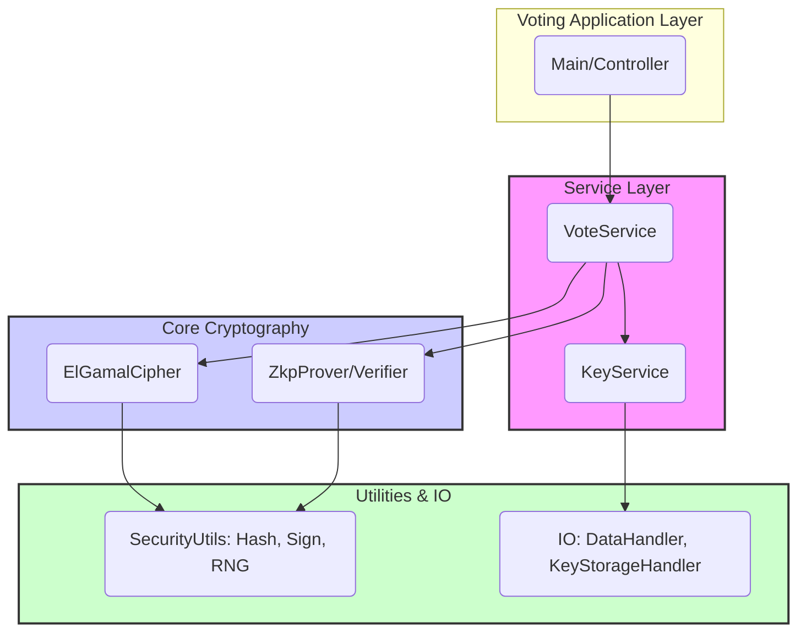

# Vote-o-matic Cryptography Architecture

This document outlines the modular Java architecture for the Vote-o-matic cryptography project, focusing on secure online voting using El Gamal encryption and Zero-Knowledge Proofs (ZKPs).

## 1. Goals

*   Provide a secure and robust cryptographic foundation for online voting.
*   Ensure modularity and separation of concerns.
*   Adhere to SOLID design principles.
*   Facilitate extensibility for future cryptographic algorithms or voting protocols.
*   Enable comprehensive unit testing.

## 2. Package Structure

The core cryptographic logic resides under `src/main/java/com/voteomatic/cryptography/`. The proposed package structure is as follows:

```
com/
└── voteomatic/
    └── cryptography/
        ├── core/             # Core cryptographic algorithms and abstractions
        │   ├── elgamal/        # El Gamal specific implementations
        │   └── zkp/            # Zero-Knowledge Proof interfaces and abstractions
        ├── keymanagement/    # Key generation, storage, retrieval, verification
        ├── voting/           # Voting protocol logic (encryption, decryption, tallying)
        ├── securityutils/    # Common security utilities (hashing, signatures, RNG)
        └── io/               # Input/Output abstraction layer
```

## 3. Modules and Key Interfaces

### 3.1. `core` Module

Contains the fundamental cryptographic building blocks.

*   **`core.elgamal.ElGamalCipher`**: Interface for El Gamal encryption and decryption operations.
    *   `encrypt(PublicKey publicKey, BigInteger message)`
    *   `decrypt(PrivateKey privateKey, Ciphertext ciphertext)`
*   **`core.elgamal.PublicKey` / `core.elgamal.PrivateKey`**: Data structures representing El Gamal keys.
*   **`core.elgamal.Ciphertext`**: Data structure representing El Gamal ciphertext.
*   **`core.zkp.ZkpProver`**: Interface for generating Zero-Knowledge Proofs.
    *   `generateProof(Statement statement, Witness witness)`
*   **`core.zkp.ZkpVerifier`**: Interface for verifying Zero-Knowledge Proofs.
    *   `verifyProof(Statement statement, Proof proof)`
*   **`core.zkp.Statement` / `core.zkp.Witness` / `core.zkp.Proof`**: Data structures for ZKP interactions.

### 3.2. `keymanagement` Module

Handles the lifecycle of cryptographic keys.

*   **`KeyService`**: Interface for managing keys.
    *   `generateKeyPair()`: Generates a new El Gamal key pair.
    *   `storeKeyPair(KeyPair keyPair, String identifier)`: Stores a key pair securely.
    *   `retrieveKeyPair(String identifier)`: Retrieves a key pair.
    *   `getPublicKey(String identifier)`: Retrieves only the public key.
    *   `verifyKeyIntegrity(PublicKey publicKey)`: Optional: Verifies key properties.

### 3.3. `voting` Module

Implements the secure voting protocol logic.

*   **`VoteService`**: Interface for voting operations.
    *   `castVote(VoterCredentials voter, Vote vote, PublicKey electionPublicKey)`: Encrypts and prepares a vote.
    *   `tallyVotes(List<EncryptedVote> encryptedVotes, PrivateKey electionPrivateKey)`: Decrypts and tallies votes.
    *   `verifyVote(EncryptedVote vote, Statement statement, Proof proof)`: Verifies a vote using ZKP.
*   **`EncryptedVote`**: Data structure containing the encrypted vote and any associated ZKP.
*   **`Vote` / `VoterCredentials`**: Data structures for vote content and voter identification/authentication.

### 3.4. `securityutils` Module

Provides common cryptographic utilities.

*   **`HashAlgorithm`**: Interface for hashing data.
    *   `hash(byte[] data)`
*   **`DigitalSignature`**: Interface for signing and verifying data.
    *   `sign(byte[] data, PrivateSigningKey privateKey)`
    *   `verify(byte[] data, byte[] signature, PublicVerificationKey publicKey)`
*   **`SecureRandomGenerator`**: Interface for generating cryptographically secure random numbers.
    *   `generateBytes(int length)`
    *   `generateBigInteger(BigInteger limit)`

### 3.5. `io` Module

Abstracts input/output operations.

*   **`DataHandler`**: Interface for reading/writing data (e.g., keys, encrypted votes).
    *   `writeData(String destination, byte[] data)`
    *   `readData(String source)`: byte[]
*   **`KeyStorageHandler` (extends `DataHandler`)**: Specialized handler potentially for secure key storage formats.

## 4. Interactions and Dependency Injection

Modules interact primarily through the defined interfaces. Dependency Injection (DI) will be used to manage dependencies between modules, promoting loose coupling.

*   **Strategy:** Constructor injection is preferred. Components will declare their dependencies (interfaces) in their constructors. A DI framework (like Guice or Spring) or manual DI container can be used to wire the application components together at startup.
*   **Example:** `VoteService` implementation would require `ElGamalCipher`, `ZkpProver`, `ZkpVerifier`, and potentially `KeyService` (to get public keys) injected via its constructor. `KeyService` might require a `KeyStorageHandler`. `ElGamalCipher` might require a `SecureRandomGenerator`.



## 5. SOLID Principles Application

*   **Single Responsibility Principle (SRP):** Each module and interface has a distinct responsibility (e.g., `KeyService` only manages keys, `ElGamalCipher` only performs El Gamal operations).
*   **Open/Closed Principle (OCP):** Modules are open for extension (e.g., adding a new `HashAlgorithm` implementation) but closed for modification (existing interfaces and their clients don't need to change).
*   **Liskov Substitution Principle (LSP):** Implementations of interfaces (e.g., different `ZkpProver` implementations) must be substitutable without altering the correctness of the program.
*   **Interface Segregation Principle (ISP):** Interfaces are granular (e.g., `HashAlgorithm`, `DigitalSignature` instead of one large `CryptoUtils` interface). Clients only depend on methods they use.
*   **Dependency Inversion Principle (DIP):** High-level modules (like `voting`) depend on abstractions (interfaces like `ElGamalCipher`, `KeyService`), not on low-level concrete implementations. DI facilitates this.

## 6. Extensibility

*   **New Algorithms:** Add new implementations of `ElGamalCipher`, `ZkpProver`, `HashAlgorithm`, `DigitalSignature`. Use DI to inject the desired implementation.
*   **Voting Protocols:** Create new implementations of `VoteService` or extend existing ones for different voting rules or tallying methods.
*   **IO Handlers:** Implement new `DataHandler` interfaces for different storage mechanisms (database, cloud storage, specific file formats).

## 7. Testability

*   **Unit Testing:** The interface-based design and DI make unit testing straightforward. Dependencies can be easily mocked (using frameworks like Mockito).
*   **Strategy:**
    *   Test each module's concrete implementations in isolation.
    *   Mock dependencies defined by interfaces (e.g., when testing `VoteService`, mock `ElGamalCipher`, `ZkpProver`, `KeyService`).
    *   Focus tests on the logic within the class under test, assuming mocked dependencies behave according to their contract.

## 8. Technical Choices & Security Considerations

*   **El Gamal:** Chosen for its additive homomorphic properties, useful for tallying encrypted votes without decryption. Requires careful parameter selection and padding schemes (not detailed here) to be secure.
*   **ZKPs:** Provide voter privacy and vote verifiability. The specific ZKP scheme (e.g., Sigma protocols, zk-SNARKs) is abstracted via interfaces. Choice of scheme impacts performance and security assumptions.
*   **Key Management:** Critical for security. The `KeyStorageHandler` abstraction allows plugging in secure storage mechanisms (e.g., HSM, secure file encryption), but the actual security depends heavily on the chosen implementation. Storing keys securely is paramount.
*   **Randomness:** Use of `SecureRandomGenerator` interface ensures reliance on cryptographically secure pseudo-random number generators (CSPRNGs), vital for key generation and encryption nonce.
*   **Trade-offs:** Using advanced cryptography like ZKPs adds complexity and potential performance overhead compared to simpler schemes. The abstraction adds some boilerplate but significantly improves maintainability and testability.