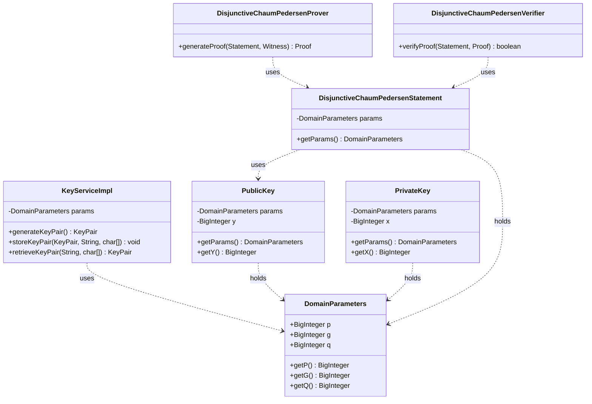

# Secure Cryptographic Parameter Handling Design

## Introduction

Analysis revealed that the `Voteomatic-cryptography` library, while correctly receiving domain parameters `p` (prime modulus) and `g` (generator) externally, incorrectly assumes the subgroup order `q` is `p-1` within the Disjunctive Chaum-Pedersen (DCP) zero-knowledge proof implementation. This design document outlines the necessary internal structural changes and external parameter management recommendations to ensure the library consistently and securely handles `p`, `g`, and `q` (the prime order of the subgroup generated by `g`).

## Proposed Internal Structural Changes

To ensure consistency and clarity, the following changes are proposed:

### Introduce `DomainParameters` Class (Recommended)

To avoid passing `p`, `g`, `q` individually throughout the codebase and to encapsulate these fundamental parameters, we recommend introducing a simple, immutable value class:

```java
// In package com.voteomatic.cryptography.core (or similar)
package com.voteomatic.cryptography.core; // Example package

import java.math.BigInteger;
import java.util.Objects;

public final class DomainParameters {
    private final BigInteger p; // Prime modulus
    private final BigInteger g; // Generator
    private final BigInteger q; // Prime order of subgroup generated by g

    /**
     * Constructs DomainParameters.
     * Basic validation (non-null) is performed. More extensive validation
     * (e.g., primality of p and q, g being a generator of order q mod p)
     * should be performed before constructing this object.
     *
     * @param p Prime modulus.
     * @param g Generator.
     * @param q Prime order of the subgroup generated by g.
     */
    public DomainParameters(BigInteger p, BigInteger g, BigInteger q) {
        this.p = Objects.requireNonNull(p, "p cannot be null");
        this.g = Objects.requireNonNull(g, "g cannot be null");
        this.q = Objects.requireNonNull(q, "q cannot be null");
        // TODO: Consider adding validation: p, q are prime, q divides p-1, g^q mod p == 1, g != 1?
    }

    public BigInteger getP() { return p; }
    public BigInteger getG() { return g; }
    public BigInteger getQ() { return q; }

    @Override
    public boolean equals(Object o) {
        if (this == o) return true;
        if (o == null || getClass() != o.getClass()) return false;
        DomainParameters that = (DomainParameters) o;
        return p.equals(that.p) && g.equals(that.g) && q.equals(that.q);
    }

    @Override
    public int hashCode() {
        return Objects.hash(p, g, q);
    }

    @Override
    public String toString() {
        return "DomainParameters{" +
               "p=" + p +
               ", g=" + g +
               ", q=" + q +
               '}';
    }
}
```

### Modifications to Core Classes

Using the `DomainParameters` class simplifies the required modifications:

*   **`PublicKey`:**
    *   Replace `p`, `g` fields with `private final DomainParameters params;`.
    *   Update constructor: `public PublicKey(DomainParameters params, BigInteger y)`.
    *   Update getters (`getP`, `getG`, `getQ`) to delegate to `params`.
    *   Update `equals`/`hashCode`/`toString`.
*   **`PrivateKey`:**
    *   Replace `p`, `g` fields with `private final DomainParameters params;`.
    *   Update constructor: `public PrivateKey(DomainParameters params, BigInteger x)`.
    *   Update getters (`getP`, `getG`, `getQ`) to delegate to `params`.
    *   Update `equals`/`hashCode`/`toString`.
*   **`KeyServiceImpl`:**
    *   Replace `p`, `g` fields with `private final DomainParameters params;`.
    *   Update constructor(s) to accept `DomainParameters params`.
    *   Update `generateKeyPair` to use `params.getQ()` for generating `x` and create keys using `this.params`.
    *   Update key storage/retrieval helpers (`convertFromJce...`) to accept and use the service's `params` object when creating `PublicKey`/`PrivateKey`.
    *   Update `verifyKeyIntegrity` to use `params.getQ()` for subgroup checks.
*   **`DisjunctiveChaumPedersenStatement`:**
    *   Add `private final DomainParameters params;`.
    *   Retrieve `params` from the `PublicKey` in the constructor.
    *   Update getters (`getP`, `getG`, `getQ`) to delegate to `params`.
*   **`DisjunctiveChaumPedersenProver`:**
    *   Retrieve `params` from the `Statement`.
    *   Retrieve `q = params.getQ()`.
    *   Use this `q` for all relevant modular arithmetic and random generation instead of `p-1`.
*   **`DisjunctiveChaumPedersenVerifier`:**
    *   Retrieve `params` from the `Statement`.
    *   Retrieve `q = params.getQ()`.
    *   Use this `q` for challenge verification and recalculation instead of `p-1`.

### Class Relationship Diagram (Mermaid)



## External Parameter Management Recommendations

Applications integrating `Voteomatic-cryptography` must securely generate, configure, and manage the `DomainParameters` (`p`, `g`, `q`).

### Parameter Source

*   **DO NOT Hardcode:** Avoid embedding `p`, `g`, `q` directly in source code.
*   **Use Standard Parameters:** Strongly prefer using well-vetted, standard Diffie-Hellman groups (e.g., RFC 3526 MODP groups, FIPS 186-4 parameters). These have undergone public scrutiny and often define `p`, `g`, and `q` (or allow `q=(p-1)/2` for safe primes).
*   **Secure Generation (If Necessary):** If custom parameters are unavoidable (requires expertise), use reputable cryptographic libraries (e.g., Bouncy Castle) following best practices for generating large primes `p` and `q` (where `q` divides `p-1`) and a generator `g` of the subgroup of order `q`.

### Configuration & Loading

*   **External Configuration:** Store `p`, `g`, `q` in secure external configuration files (e.g., Java Properties, YAML, JSON) with appropriate file permissions.
*   **Secure Loading:** Load parameters securely at application startup.
*   **Environment Variables:** Use with caution due to potential visibility; ensure strict access control if used.

### Validation

*   **Application Startup:** Perform basic validation on loaded parameters (non-null, potentially primality tests if not using standard groups). The `DomainParameters` constructor can assist.
*   **Consistency:** Ensure the *same* `DomainParameters` instance/values are used consistently across all cryptographic operations within the application. Pass the parameters explicitly when initializing services like `KeyServiceImpl`.

### Parameter Lifecyle

*   **Updates:** Plan for updating parameters if the chosen group becomes weak or standards evolve. External configuration simplifies this.
*   **Distribution:** Securely distribute parameters if multiple application instances require the same set.

## Conclusion

Implementing these internal changes and adhering to the external management recommendations will significantly improve the security and robustness of the `Voteomatic-cryptography` library by ensuring the correct and consistent handling of the fundamental domain parameters `p`, `g`, and `q`.